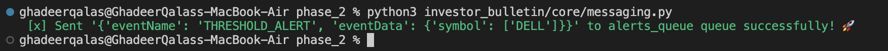
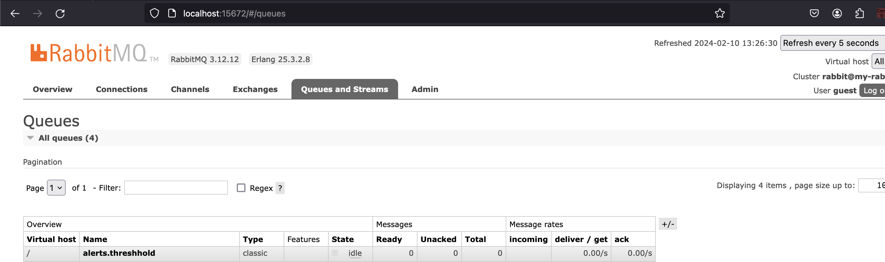
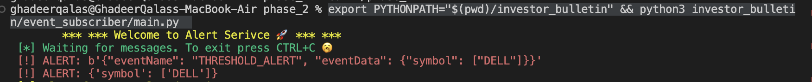
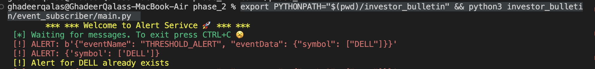
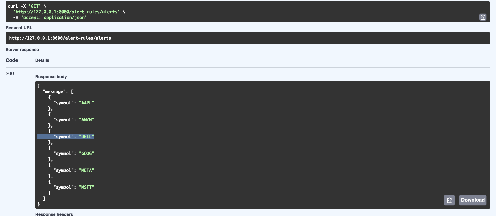

# PHASE TWO (Creating publisher/Subscriber)

## Technology used

> 📢📢📢 please use `Topic Exchange` as your message routing agents [for more info](https://www.cloudamqp.com/blog/part4-rabbitmq-for-beginners-exchanges-routing-keys-bindings.html)

- Publisher - [amqpstorm](https://www.amqpstorm.io/examples/simple_publisher.html)
- Subscriber - [Pika](https://pika.readthedocs.io/en/stable/intro.html)
- Broker [RabbitMQ](https://www.rabbitmq.com/tutorials/tutorial-one-python.html)

## Objectives

to be able to publish `THRESHOLD_ALERT` event through a message queue and consume it thought a subscriber to that queue and print the result of that event and create a new alert record

## Functionality

- **Publish a `THRESHOLD_ALERT` event**
- **Consume the `THRESHOLD_ALERT` event and print the message aka the alert**

## TASKS Breakdown

- [ ] **Copy all your work in phase one**
--
- [ ] **Set up your environment**
 Whether on your machine or using docker, make sure you have a running rabbitmq broker
--
- [ ] **Get to know Rabbitmq and Configure the queues**
--
- [ ] **Create a publisher connection using amqpstorm inside the core/messaging.py file**
--
- [ ] **Publish a `THRESHOLD_ALERT` event by running the core/messaging.py file**
--
- [ ] **Create a consumer connection using pika inside the event_subscriber/main.py**
--
- [ ] **Consumed the published event and print the message by running the the event_subscriber/main.py**
--
- [ ] **Create an event record by using the alert_service.py**

## What's next

- **If you complete the tasks**, just send an email with the a link of your work in your github, tell us more about your comfort level out of 5 and what was the most challenging part and the most rewarding part.
--

- **If you stuck, or it took so long*- it ok, we understand just send an email with the a link of your work in your github, tell us more about your comfort level out of 5 and how much did you actually completed from the task out of 7, where are you stuck or what took the most of your time

## Ghadeer Instructions

- **Run the project**
  - I set-up the my own rabbitmq locally by using the docker:
      - docker pull rabbitmq:3-management
      - docker run -d --hostname my-rabbit --name some-rabbit -p 5672:5672 -p 15672:15672 rabbitmq:3-management
  - "Publisher" python3 investor_bulletin/core/messaging.py
  - "Consumer" export PYTHONPATH="$(pwd)/investor_bulletin" && python3 investor_bulletin/event_subscriber/main.py

## (Output)
  - Publish a THRESHOLD_ALERT event by running the core/messaging.py file --
   - 
   - 
  - Create a consumer connection using pika inside the event_subscriber/main.py --
  - Consumed the published event and printed the message by running the event_subscriber/main.py --
    - 
    - 
  - Create an event record by using the alert_service.py
    - 

